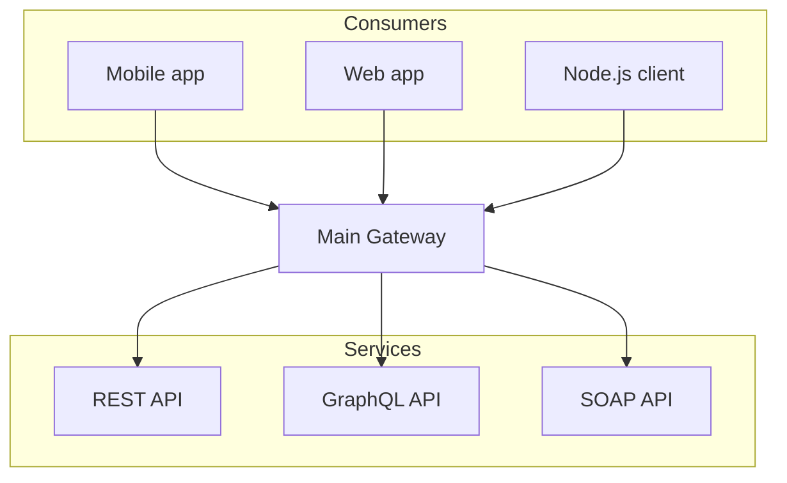
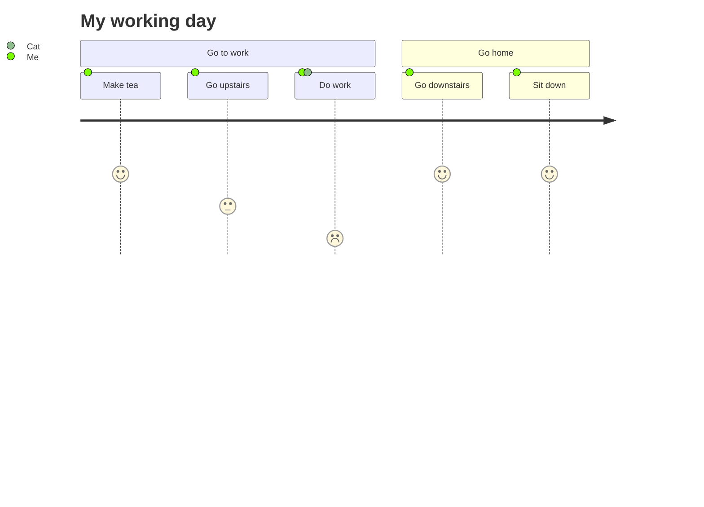

## Documentation

This documentation page will guide you on how to use Braindump effectively. As the application evolves, this section will be updated with more detailed information.

## Getting Started

*   **Navigation:** Use the left sidebar to browse through different sections of your digital garden: Pages, Content Sections (like Zettels, Wikis), and Tags.
*   **Content Viewing:** Click on a note or topic in the sidebar to view its content in the main area.
*   **Theming:** Use the theme toggle (sun/moon icon) in the navbar to switch between light and dark modes.
*   **Fonts:** Use the font selector in the navbar to change the application's display font.

## Writing Math Equations

You can write mathematical notations using KaTeX.

**Inline Math:**

An example of an inline equation is $$c = \pm\sqrt{a^2 + b^2}$$. You can write it directly in your text.

**Block Math:**

For more complex equations, use a math code block:

```math
c = \pm\sqrt{a^2 + b^2}
```

Taylor Expansion (expressing holomorphic function $$f(x)$$ in power series):

```math
\displaystyle {\begin{aligned}T_{f}(z)&=\sum _{k=0}^{\infty }{\frac {(z-c)^{k}}{2\pi i}}\int _{\gamma }{\frac {f(w)}{(w-c)^{k+1}}}\,dw\\&={\frac {1}{2\pi i}}\int _{\gamma }{\frac {f(w)}{w-c}}\sum _{k=0}^{\infty }\left({\frac {z-c}{w-c}}\right)^{k}\,dw\\&={\frac {1}{2\pi i}}\int _{\gamma }{\frac {f(w)}{w-c}}\left({\frac {1}{1-{\frac {z-c}{w-c}}}}\right)\,dw\\&={\frac {1}{2\pi i}}\int _{\gamma }{\frac {f(w)}{w-z}}\,dw=f(z),\end{aligned}}
```

You can often copy equations from sources like Wikipedia, and they will be rendered correctly if they are in TeX format. For example:

```math
\displaystyle S[{\boldsymbol {q}}]=\int _{a}^{b}L(t,{\boldsymbol {q}}(t),{\dot {\boldsymbol {q}}}(t))\,dt.
```

## Rendering Diagrams

You can render diagrams using Mermaid syntax within `mermaid` code blocks.

**Example Diagram:**



**Example User Journey:**


## Content Structure (Simulated)

Currently, the content is simulated using mock data within the application. The structure mirrors a file system:

```
src/
└── content/
    └── mockData.ts (defines the structure and content)

Example structure within mockData:
- Zettels/
  - Note A
  - Note B/
    - Sub Note A
- Wikis/
  - Programming/
    - JavaScript/
      - Conditional Rendering
...and so on.
```

## Future Features (Planned)

*   Actual MDX file processing.
*   Full-text search.
*   Dynamic Table of Contents generation based on all content.
*   Backlink display.
*   Editable notes directly within the app.
*   More robust tagging system.

Thank you for using Braindump! We hope it becomes a valuable tool for your personal knowledge management.
